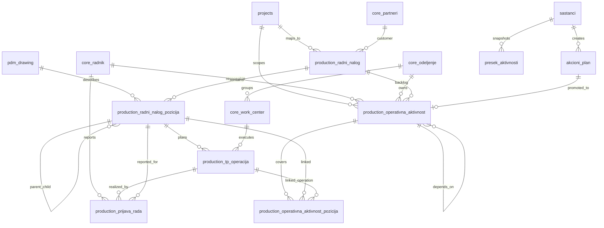

# Praćenje proizvodnje - arhitektonska analiza

> Status: draft v0.1  
> Datum: 25. april 2026  
> Opseg: analiza novog modula sa dva taba, bez SQL migracija i bez izmena postojeće šeme.

---

## 1. Sažetak modula

Modul **Praćenje proizvodnje** treba da bude Faza 2 proizvodni/MES sloj iznad postojećih podataka o projektima, radnim nalozima, tehnološkim postupcima i prijavama rada. Modul ima dva ravnopravna pogleda nad istim radnim nalogom:

1. **Po pozicijama** - tehnički, hijerarhijski pregled RN-a: pozicije/sklopovi, TP operacije i agregati prijava rada u realnom vremenu.
2. **Operativni plan** - kuratovani backlog aktivnosti po odeljenjima: ko šta radi, kada kasni, šta je blokirano i ko je odgovoran.

Tab 1 je bliži BigTehn/QMegaTeh strukturi (`tRN`, `tStavkeRN`, `tTehPostupak`, `tRNKomponente`, PDM crteži). Tab 2 je novi domenski nivo: nije isto što i TP operacija i ne treba ga gurati u `akcioni_plan` ili `presek_aktivnosti`. Treba ga povezati sa njima.

Ključni princip: **legacy staging/cache tabele nisu kanonski model**. One pomažu migraciji i validaciji, ali cilj je on-prem Postgres model po šemama `production`, `pdm`, `inventory`, `core`, `meetings`, `audit`.

---

## 2. Izvori i postojeći entiteti

### 2.1 Pročitani izvori

- `docs/QMegaTeh_Dokumentacija.md`
- `docs/migration/04-qbigtehn-schema-inventory.md`
- `c:\Users\nenad.jarakovic\Desktop\BigbitRaznoNenad\script.sql`
- `docs/Plan_montaze_modul.md`
- `docs/Planiranje_proizvodnje_modul.md`
- `docs/SUPABASE_PUBLIC_SCHEMA.md`
- `docs/RBAC_MATRIX.md`
- `docs/Kadrovska_modul.md`

Napomena: `script.sql` nije u korenu repoa; korišćen je sa putanje dokumentovane u `04-qbigtehn-schema-inventory.md`.

### 2.2 Relevantne legacy tabele za Tab 1

| Legacy tabela | Svrha | Ključne kolone | FK / veze |
|---|---|---|---|
| `tRN` | Glavni radni nalog | `IDRN`, `IDPredmet`, `IdentBroj`, `Varijanta`, `BBIDKomitent`, `BrojCrteza`, `NazivDela`, `Materijal`, `Komada`, `RokIzrade`, `StatusRN`, `IDCrtez`, `SifraRadnika` | `SifraRadnika -> tRadnici`, `SifraRadnikaPrimopredaje -> tRadnici`, `IDVrstaKvaliteta -> tVrsteKvalitetaDelova`, `IDStatusPrimopredaje -> StatusiPrimopredaje`; implicitno `IDPredmet -> Predmeti`, `IDCrtez -> PDMCrtezi` |
| `tStavkeRN` | Planirane operacije po RN-u | `IDStavkeRN`, `IDRN`, `Operacija`, `RJgrupaRC`, `OpisRada`, `Tpz`, `Tk`, `TezinaTO`, `SifraRadnika`, `Prioritet` | `IDRN -> tRN`, `RJgrupaRC -> tOperacije`, `SifraRadnika -> tRadnici` |
| `tTehPostupak` | Realne prijave rada / izvršeni postupci | `IDPostupka`, `IDRN`, `SifraRadnika`, `Operacija`, `RJgrupaRC`, `Komada`, `DatumIVremeUnosa`, `DatumIVremeZavrsetka`, `ZavrsenPostupak`, `Napomena`, `DoradaOperacije` | `SifraRadnika -> tRadnici`; u praksi vezuje se na RN i operaciju preko `IDRN`, `Operacija`, `RJgrupaRC` |
| `tRNKomponente` | Struktura RN-a, parent RN -> podkomponenta RN | `IDKomponente`, `IDRN`, `IDRNPodkomponenta`, `BrojKomada`, `Napomena` | `IDRN -> tRN`; `IDRNPodkomponenta` je logički FK na `tRN.IDRN`, iako je u exportu eksplicitno vezan samo parent |
| `PDMCrtezi` | Crteži i PDM metadata | `IDCrtez`, `BrojCrteza`, `Revizija`, `Naziv`, `Materijal`, `RN`, `Dimenzije`, `Kolicina`, `IDStatusCrteza`, `Nabavka` | `IDStatusCrteza -> StatusiCrteza`; unique `BrojCrteza, Revizija` |
| `tOperacije` | Operacije / radni centri | `IDOperacije`, `RJgrupaRC`, `NazivGrupeRC`, `IDRadneJedinice`, `BezPostupka`, `ZnacajneOperacijeZaZavrsen`, `KoristiPrioritet`, `PreskocivaOperacija` | `RJgrupaRC` koristi `tStavkeRN`, `tPDM`, `tPLP`, `tPND`, `tPristupMasini` |
| `tRadnici` | Proizvodni radnici | `SifraRadnika`, `Radnik`, `ImeIPrezime`, `IDRadneJedinice`, `IDKartice`, `IDVrsteRadnika`, `Aktivan` | Veze iz RN, stavki RN, prijava rada, pristupa mašini |
| `tLansiranRN` | Workflow lansiranja RN-a | `IDLansiran`, `IDRN`, `Lansiran`, `DatumUnosa`, `SifraRadnikaUnos` | `IDRN -> tRN` |
| `tSaglasanRN` | Workflow saglasnosti RN-a | `IDSaglasan`, `IDRN`, `Saglasan`, `DatumUnosa`, `SifraRadnikaUnos` | `IDRN -> tRN` |
| `tStavkeRNSlike` | Dokumentacija uz planiranu operaciju | `IDStavkeRN`, file metadata u povezanoj tabeli | `IDStavkeRN -> tStavkeRN` |
| `tTehPostupakDokumentacija` | Dokumentacija uz prijavu rada | `IDPostupka`, file metadata | `IDPostupka -> tTehPostupak` |

### 2.3 Postojeće Supabase / Faza 1 tabele koje ne treba duplirati

| Tabela | Uloga u postojećem sistemu | Odnos prema novom modulu |
|---|---|---|
| `projects` | Projekat iz plana montaže: šifra, naziv, PM/lead PM, rok, status | Koristi se kao postojeći projekat/header kontekst |
| `work_packages` | Pozicija / RN u planu montaže, sa `rn_code`, imenom, rokom, default odgovornima | Može biti UI veza ka RN-u, ali Faza 2 treba kanonski `production.radni_nalog` |
| `phases` | Faze plana montaže | Ne koristiti kao proizvodne TP operacije; može ostati paralelan montažni plan |
| `akcioni_plan` | Akcione tačke sa sastanka (`naslov`, `opis`, `rok`, `status`, `prioritet`, odgovorni) | Izvor za promociju u operativnu aktivnost |
| `presek_aktivnosti` | Snapshot aktivnosti u toku sastanka, vezan za `sastanak_id`, ima `pod_rn` | Prikaz/snapshot iz operativnog plana, ne trajan backlog |
| `sastanci`, `pm_teme` | Sastanci i teme | Integracija za tok sastanak -> aktivnost |
| `employees` | Kadrovska evidencija zaposlenih | Kandidat za `odgovoran_user_id` ili mapiranje nadimaka |
| `user_roles` | RBAC izvor uloga | Osnova za pristup i edit pravila |
| `bigtehn_*_cache` | Trenutni read-only cache iz BigTehn-a | Koristan za migraciju, ali kanonski Faza 2 model treba da zameni cache |

---

## 3. Predloženi kanonski Postgres model

### 3.1 Šeme i granice

| Schema | Svrha |
|---|---|
| `core` | korisnici, radnici, odeljenja, partneri, predmeti, organizacija |
| `production` | radni nalozi, pozicije, TP operacije, prijave rada, operativne aktivnosti |
| `pdm` | crteži, revizije, BOM/where-used, dokumentacija |
| `inventory` | lokacije, materijal, komponente, kretanja delova |
| `meetings` | sastanci, teme, akcioni plan, preseci |
| `audit` | audit log i istorija promena |
| `legacy` | staging/import kopije legacy tabela i mapping ključevi |

### 3.2 Osnovne tabele za proizvodnju

| Target tabela | Svrha | Bitna polja |
|---|---|---|
| `production.radni_nalog` | Kanonski RN | `id`, `projekat_id`, `case_id`, `kupac_id`, `rn_broj`, `naziv`, `datum_isporuke`, `rok_izrade`, `status`, `koordinator_user_id`, `napomena`, `legacy_idrn`, `legacy_idpredmet`, `legacy_idcrtez` |
| `production.radni_nalog_pozicija` | Jedna pozicija/sklop/podsklop RN-a | `id`, `radni_nalog_id`, `parent_id`, `drawing_id`, `sifra_pozicije`, `naziv`, `kolicina_plan`, `jedinica_mere`, `sort_order`, `legacy_idrn`, `legacy_idkomponente` |
| `production.tp_operacija` | Planirana operacija za poziciju/RN | `id`, `radni_nalog_pozicija_id`, `operacija_kod`, `work_center_id`, `opis_rada`, `alat_pribor`, `tpz`, `tk`, `prioritet`, `legacy_idstavke_rn` |
| `production.prijava_rada` | Realna prijava rada | `id`, `radni_nalog_id`, `radni_nalog_pozicija_id`, `tp_operacija_id`, `radnik_id`, `operacija_kod`, `work_center_id`, `kolicina`, `started_at`, `finished_at`, `is_completed`, `napomena`, `legacy_idpostupka` |
| `production.radni_nalog_lansiranje` | Lansiranje RN-a | `id`, `radni_nalog_id`, `lansiran`, `created_at`, `created_by_radnik_id`, `legacy_idlansiran` |
| `production.radni_nalog_saglasnost` | Saglasnost RN-a | `id`, `radni_nalog_id`, `saglasan`, `created_at`, `created_by_radnik_id`, `legacy_idsaglasan` |
| `core.work_center` | Radni centar / mašina / grupa operacija | `id`, `kod`, `naziv`, `odeljenje_id`, `legacy_rjgruparc`, `legacy_idoperacije` |
| `core.radnik` | Proizvodni radnik | `id`, `employee_id`, `sifra_radnika`, `ime`, `puno_ime`, `aktivan`, `odeljenje_id`, `legacy_sifra_radnika` |
| `pdm.drawing` | Crtež | `id`, `drawing_no`, `revision`, `naziv`, `materijal`, `dimenzije`, `status_id`, `legacy_idcrtez` |

Naming: u novom modelu koristiti srpski poslovni naziv tamo gde je domen već tako nazvan (`radni_nalog`, `prijava_rada`), uz `snake_case` i `legacy_*` kolone za mapiranje.

---

## 4. Tab 1 - Pregled po pozicijama

### 4.1 Namena

Tab 1 reprodukuje tehnički pregled RN-a iz primera PDF-a: hijerarhija pozicija/sklopova, planirane TP operacije i live agregati prijava rada. Koriste ga tehnolog, poslovođa i proizvodnja za odgovor na pitanja:

- šta je sve u RN-u,
- koje operacije su planirane po poziciji,
- koliko komada je lansirano/planirano,
- koliko je prijavljeno po operaciji,
- šta je završeno, u toku ili nije krenulo.

### 4.2 Hijerarhijski model pozicija

`production.radni_nalog_pozicija` treba da bude rekurzivna tabela:

| Polje | Tip / značenje |
|---|---|
| `id` | `uuid`, PK |
| `radni_nalog_id` | FK na `production.radni_nalog` |
| `parent_id` | self FK na `production.radni_nalog_pozicija.id`, nullable za root pozicije |
| `drawing_id` | FK na `pdm.drawing`, nullable |
| `sifra_pozicije` | broj crteža, oznaka ili izvedeni kod pozicije |
| `naziv` | naziv dela/sklopa |
| `kolicina_plan` | planirana/lansirana količina |
| `jedinica_mere` | npr. `kom`, `set`, `m` |
| `sort_order` | redosled u tree-gridu |
| `legacy_idrn` | legacy `tRN.IDRN`, kada pozicija odgovara RN-u |
| `legacy_idkomponente` | legacy `tRNKomponente.IDKomponente`, kada je došla iz strukture komponenti |

Rekurzija se puni iz `tRNKomponente`:

```text
tRN.IDRN = glavni RN
  -> tRNKomponente.IDRN = parent RN
  -> tRNKomponente.IDRNPodkomponenta = child RN
```

Ako legacy podaci nemaju eksplicitne sve nivoe za pojedini primer, root pozicija može biti `production.radni_nalog` kao root, a podpozicije se dodaju onoliko koliko postoje u `tRNKomponente` / PDM BOM-u.

### 4.3 Agregacija prijava rada

Brojevi u kolonama operacija, npr. `Struganje 97`, `Glodanje 82`, ne treba da budu ručno polje. Računaju se iz prijava rada:

```sql
-- Specifikacija, nije migracija:
select
  pr.radni_nalog_pozicija_id,
  pr.tp_operacija_id,
  sum(pr.kolicina) as prijavljeno_komada,
  count(*) as broj_prijava,
  max(pr.finished_at) as poslednja_prijava_at
from production.prijava_rada pr
group by pr.radni_nalog_pozicija_id, pr.tp_operacija_id;
```

Efektivni status operacije:

| Uslov | Status |
|---|---|
| `sum(kolicina) = 0` | `nije_krenulo` |
| `sum(kolicina) > 0 and sum(kolicina) < kolicina_plan` | `u_toku` |
| `sum(kolicina) >= kolicina_plan` | `zavrseno` |
| ručni blokator na poziciji/operaciji | `blokirano` |

Za performanse treba predvideti indeksiranje po:

- `production.prijava_rada(radni_nalog_id, radni_nalog_pozicija_id, tp_operacija_id)`
- `production.tp_operacija(radni_nalog_pozicija_id, work_center_id)`
- `production.radni_nalog_pozicija(radni_nalog_id, parent_id, sort_order)`

### 4.4 RPC `production.get_pracenje_rn(p_rn_id uuid)`

RPC treba da vrati jedan JSON payload za ekran, sa headerom, tree strukturom i agregatima.

Primer oblika:

```json
{
  "header": {
    "radni_nalog_id": "uuid",
    "rn_broj": "RN-2026-001",
    "projekat_id": "uuid",
    "projekat_naziv": "Linija X",
    "kupac": "Kupac d.o.o.",
    "datum_isporuke": "2026-06-15",
    "koordinator": "Nenad",
    "napomena": "Prioritetna isporuka"
  },
  "summary": {
    "pozicija_total": 42,
    "operacija_total": 180,
    "nije_krenulo": 50,
    "u_toku": 88,
    "zavrseno": 40,
    "blokirano": 2
  },
  "positions": [
    {
      "id": "uuid",
      "parent_id": null,
      "sifra_pozicije": "SC-1000",
      "naziv": "Sklop ruke",
      "kolicina_plan": 12,
      "progress_pct": 68,
      "operations": [
        {
          "tp_operacija_id": "uuid",
          "operacija_kod": 10,
          "naziv": "Struganje",
          "work_center": "2.1",
          "planirano_komada": 12,
          "prijavljeno_komada": 8,
          "status": "u_toku",
          "poslednja_prijava_at": "2026-04-25T08:30:00+02:00"
        }
      ],
      "children": []
    }
  ]
}
```

### 4.5 Mapping PDF primera -> model

| PDF izlazna kolona / informacija | Izvor u modelu | Računanje |
|---|---|---|
| RN broj | `production.radni_nalog.rn_broj` | legacy `tRN.IdentBroj` |
| Naziv dela / pozicije | `production.radni_nalog_pozicija.naziv` | legacy `tRN.NazivDela` / `PDMCrtezi.Naziv` |
| Broj crteža | `pdm.drawing.drawing_no` ili `radni_nalog_pozicija.sifra_pozicije` | legacy `tRN.BrojCrteza`, `PDMCrtezi.BrojCrteza` |
| Revizija | `pdm.drawing.revision` | legacy `PDMCrtezi.Revizija`, `tRN.Revizija` |
| Količina/lansirano | `radni_nalog_pozicija.kolicina_plan` | legacy `tRN.Komada`, `tRNKomponente.BrojKomada` |
| Materijal | `pdm.drawing.materijal` ili `radni_nalog.materijal_snapshot` | legacy `tRN.Materijal`, `PDMCrtezi.Materijal` |
| Operacija, npr. struganje/glodanje | `production.tp_operacija` + `core.work_center` | legacy `tStavkeRN.Operacija`, `RJgrupaRC -> tOperacije` |
| Planirano vreme | `tp_operacija.tpz`, `tp_operacija.tk` | `tpz + tk * kolicina_plan` |
| Prijavljeno po operaciji | `production.prijava_rada` | `sum(kolicina) group by pozicija, operacija` |
| Status pozicije | view/RPC agregat | izveden iz statusa operacija i blokatora |
| Napomena | `radni_nalog.napomena`, `tp_operacija.napomena`, `prijava_rada.napomena` | zavisi od nivoa prikaza |

---

## 5. Tab 2 - Operativni plan

### 5.1 Namena

Operativni plan je live backlog za jedan projekat/RN, organizovan po odeljenjima. Koristi se na koordinacionim sastancima i u menadžment pregledu. Aktivnost nije isto što i TP operacija:

- jedna aktivnost može pokrivati više pozicija i više TP operacija,
- može biti preduslov bez proizvodne prijave rada, npr. materijal i priprema,
- može nastati ručno, iz akcione tačke sa sastanka ili iz proizvodnog/TP konteksta.

### 5.2 `core.odeljenje`

Šifarnik odeljenja treba da bude zajednički za proizvodnju, radnike, work centre i UI boje.

| Polje | Značenje |
|---|---|
| `id` | `uuid`, PK |
| `kod` | stabilan kod, npr. `ZAV`, `MAS`, `FAR` |
| `naziv` | prikazni naziv |
| `vodja_user_id` | nullable FK na korisnika |
| `vodja_radnik_id` | nullable FK na `core.radnik` |
| `boja` | HEX boja za UI badge |
| `sort_order` | redosled u dashboardu |
| `aktivan` | soft toggle |
| `legacy_department_id` | veza na `bigtehn_departments_cache.id` ili stari OD/OJ kod |

### 5.3 Seed lista odeljenja

| kod | naziv | boja | sort_order |
|---|---|---:|---:|
| `ZAV` | Zavarivanje | `#ef4444` | 10 |
| `MAS` | Mašinska obrada | `#3b82f6` | 20 |
| `FAR` | Farbanje | `#f59e0b` | 30 |
| `MON` | Montaža | `#10b981` | 40 |
| `ELA` | Elektrika/Automatika | `#8b5cf6` | 50 |
| `KK` | Kontrola kvaliteta | `#06b6d4` | 60 |
| `LOG` | Logistika | `#64748b` | 70 |

Ovo je tekstualna seed lista za dokumentaciju, ne SQL.

### 5.4 Enumi

Predlog Postgres enum tipova:

| Enum | Vrednosti |
|---|---|
| `production.aktivnost_status` | `nije_krenulo`, `u_toku`, `blokirano`, `zavrseno` |
| `production.aktivnost_prioritet` | `nizak`, `srednji`, `visok` |
| `production.aktivnost_izvor` | `rucno`, `iz_sastanka`, `iz_tp`, `iz_proizvodnje` |
| `production.aktivnost_status_mode` | `manual`, `auto_from_pozicija`, `auto_from_operacije` |

### 5.5 `production.operativna_aktivnost`

| Polje | Značenje |
|---|---|
| `id` | `uuid`, PK |
| `radni_nalog_id` | FK na `production.radni_nalog`, obavezno za RN-level aktivnost |
| `projekat_id` | FK na postojeći `projects`, radi Faza 1 integracije |
| `rb` | redni broj u planu |
| `odeljenje_id` | FK na `core.odeljenje` |
| `naziv_aktivnosti` | naslov iz Excel kolone `Aktivnost` |
| `opis` | detaljniji opis |
| `broj_tp` | slobodan tekst ili referenca na TP oznaku; Excel ga tretira kao prikazno polje |
| `kolicina_text` | slobodan tekst, npr. `12P + 12BP` |
| `planirani_pocetak` | datum |
| `planirani_zavrsetak` | datum |
| `odgovoran_user_id` | FK na app korisnika, nullable |
| `odgovoran_radnik_id` | FK na `core.radnik`, nullable |
| `odgovoran_label` | fallback prikaz za nadimke iz Excela |
| `zavisi_od_aktivnost_id` | self FK za strukturisanu zavisnost |
| `zavisi_od_text` | fallback slobodan tekst za postojeći Excel način rada |
| `status` | ručni status, tip `production.aktivnost_status` |
| `status_mode` | `manual`, `auto_from_pozicija` ili `auto_from_operacije` |
| `manual_override_status` | nullable, koristi se za eksplicitno blokiranje preko auto statusa |
| `blokirano_razlog` | obavezan kada je efektivni status `blokirano` |
| `prioritet` | tip `production.aktivnost_prioritet` |
| `rizik_napomena` | Excel kolona `Rizik / napomena` |
| `izvor` | tip `production.aktivnost_izvor` |
| `izvor_akcioni_plan_id` | FK na `meetings.akcioni_plan` / postojeći `akcioni_plan` |
| `izvor_pozicija_id` | FK na `production.radni_nalog_pozicija` |
| `izvor_tp_operacija_id` | FK na `production.tp_operacija`, nullable |
| `created_at`, `created_by` | audit metadata |
| `updated_at`, `updated_by` | audit metadata |
| `zatvoren_at`, `zatvoren_by`, `zatvoren_napomena` | zatvaranje aktivnosti |
| `legacy_id` | opcionalno; najverovatnije null jer legacy nema ekvivalent |

Ako jedna aktivnost treba da pokrije više pozicija, ne proširivati `izvor_pozicija_id` u array. Uvesti join tabelu:

| Tabela | Svrha |
|---|---|
| `production.operativna_aktivnost_pozicija` | `aktivnost_id`, `radni_nalog_pozicija_id`, `tp_operacija_id`, `tezina`, `napomena` |

Tada `izvor_pozicija_id` ostaje za najčešći single-link slučaj, a join tabela pokriva Excel primere tipa `Vratilo kasete P i BP - 36P + 36BP`.

### 5.6 Auto-derivacija statusa iz prijava rada

Za aktivnosti vezane na konkretnu poziciju ili TP operacije status treba da se računa iz proizvodnih prijava, a ne ručno.

Logika:

| Uslov | Efektivni status |
|---|---|
| `manual_override_status = blokirano` | `blokirano` |
| nema vezanih pozicija/operacija i `status_mode = manual` | `status` |
| `planirano_komada > 0` i `prijavljeno_komada = 0` | `nije_krenulo` |
| `prijavljeno_komada > 0` i `prijavljeno_komada < planirano_komada` | `u_toku` |
| `prijavljeno_komada >= planirano_komada` | `zavrseno` |

Za aktivnost sa više pozicija:

- `zavrseno` samo ako su sve vezane pozicije/operacije završene,
- `u_toku` ako je bar jedna krenula, a nisu sve završene,
- `nije_krenulo` ako nijedna nema prijavu,
- `blokirano` ako postoji ručni override ili blokator na bilo kojoj vezanoj stavci.

### 5.7 View `production.v_operativna_aktivnost`

View treba da vrati osnovna polja aktivnosti plus izvedene kolone:

| Kolona | Pravilo |
|---|---|
| `planirano_komada` | iz `radni_nalog_pozicija.kolicina_plan` ili zbir preko join tabele |
| `prijavljeno_komada` | `sum(production.prijava_rada.kolicina)` |
| `auto_status` | status iz agregata prijava |
| `efektivni_status` | `blokirano` override, zatim auto status ako je auto mode, inače manual `status` |
| `status_is_auto` | true ako status dolazi iz proizvodnih prijava |
| `rezerva_dani` | `datum_isporuke - planirani_zavrsetak` |
| `kasni` | `current_date > planirani_zavrsetak and efektivni_status <> 'zavrseno'` |
| `dashboard_odeljenje` | naziv i kod odeljenja za grupisanje |

Supabase/Postgres bezbednosna napomena: ako view ide u izloženu šemu, treba ga definisati kao `security_invoker = true` na Postgres 15+, ili držati u neizloženoj šemi uz eksplicitne grantove.

### 5.8 RPC specifikacije

#### `production.get_operativni_plan(p_rn_id uuid) returns jsonb`

Vraća header + aktivnosti + dashboard agregate.

```json
{
  "header": {
    "radni_nalog_id": "uuid",
    "projekat_id": "uuid",
    "kupac": "Kupac d.o.o.",
    "rn_broj": "RN-2026-001",
    "masina_linija": "Linija za pakovanje",
    "datum_isporuke": "2026-06-15",
    "koordinator": "Nenad",
    "napomena": "Sastanak ponedeljkom"
  },
  "filters": {
    "odeljenja": ["Zavarivanje", "Mašinska obrada"],
    "statusi": ["nije_krenulo", "u_toku", "blokirano", "zavrseno"]
  },
  "activities": [
    {
      "id": "uuid",
      "rb": 10,
      "odeljenje": "Zavarivanje",
      "naziv_aktivnosti": "Zavarivanje segment ruke 1 P i BP",
      "broj_tp": "TP-100",
      "kolicina_text": "12P + 12BP",
      "planirani_pocetak": "2026-04-27",
      "planirani_zavrsetak": "2026-05-03",
      "odgovoran": "Aleksa",
      "zavisi_od": "Materijal i priprema delova",
      "efektivni_status": "u_toku",
      "status_is_auto": true,
      "status_detail": "prijavljeno 82/100",
      "prioritet": "visok",
      "rizik_napomena": "Kasni materijal",
      "rezerva_dani": 43,
      "kasni": false
    }
  ],
  "dashboard": {
    "total": { "ukupno": 28, "zavrseno": 9, "u_toku": 12, "blokirano": 2, "najkasniji_planirani_zavrsetak": "2026-06-01" },
    "po_odeljenjima": [
      { "odeljenje": "Zavarivanje", "ukupno": 6, "zavrseno": 2, "u_toku": 3, "blokirano": 1, "najkasniji_planirani_zavrsetak": "2026-05-20" }
    ]
  }
}
```

#### `production.upsert_operativna_aktivnost(...)`

Služi za kreiranje i izmenu aktivnosti. Minimalni input:

- `p_id uuid default null`
- `p_radni_nalog_id uuid`
- `p_projekat_id uuid`
- `p_odeljenje_id uuid`
- `p_naziv_aktivnosti text`
- `p_planirani_pocetak date`
- `p_planirani_zavrsetak date`
- `p_odgovoran_user_id uuid default null`
- `p_odgovoran_radnik_id uuid default null`
- `p_status production.aktivnost_status default 'nije_krenulo'`
- `p_prioritet production.aktivnost_prioritet default 'srednji'`
- ostala nullable polja za `broj_tp`, `kolicina_text`, zavisnosti, rizik i izvor.

#### `production.zatvori_aktivnost(p_id uuid, p_napomena text)`

Postavlja `status = 'zavrseno'` za manual aktivnosti ili `manual_override_status = null` i `zatvoren_at`, `zatvoren_by`, `zatvoren_napomena`. Za auto aktivnosti treba dozvoliti zatvaranje samo ako agregati proizvodnje potvrđuju završetak ili ako rola ima pravo override-a.

#### `production.promovisi_akcionu_tacku(p_akcioni_plan_id uuid, p_odeljenje_id uuid, p_rn_id uuid)`

Kreira `production.operativna_aktivnost` iz `akcioni_plan`:

- `naziv_aktivnosti <- akcioni_plan.naslov`
- `opis <- akcioni_plan.opis`
- `planirani_zavrsetak <- akcioni_plan.rok`
- `prioritet <- mapiranje prioritet integer -> enum`
- `odgovoran_label/email <- akcioni_plan.odgovoran_*`
- `izvor = 'iz_sastanka'`
- `izvor_akcioni_plan_id = p_akcioni_plan_id`
- `projekat_id` se preuzima iz akcione tačke ili RN-a.

### 5.9 Dashboard agregati

Ekvivalent Excel `Pregled` sheet-a:

| Excel formula koncept | SQL/view koncept |
|---|---|
| `COUNTIF(Odeljenje)` | `count(*) filter (where odeljenje_id = ...)` |
| `COUNTIFS(Odeljenje, Status='Završeno')` | `count(*) filter (where efektivni_status = 'zavrseno')` |
| `COUNTIFS(Odeljenje, Status='U toku')` | `count(*) filter (where efektivni_status = 'u_toku')` |
| `COUNTIFS(Odeljenje, Status='Blokirano')` | `count(*) filter (where efektivni_status = 'blokirano')` |
| `MAXIFS(Planirani završetak, Odeljenje)` | `max(planirani_zavrsetak) filter (where odeljenje_id = ...)` |
| `Rezerva do isporuke` | `datum_isporuke - planirani_zavrsetak` |
| `Kasni?` | `current_date > planirani_zavrsetak and efektivni_status <> 'zavrseno'` |

### 5.10 Mapping XLSX primera -> model

| Excel kolona / header | Postgres polje / računanje |
|---|---|
| Projekat / kupac | `projects.project_name`, budući `core.partner.name` / `production.radni_nalog.kupac_id` |
| Mašina / linija | `production.radni_nalog.naziv` |
| RN broj | `production.radni_nalog.rn_broj` |
| Datum isporuke | `production.radni_nalog.datum_isporuke` ili `projects.project_deadline` kao fallback |
| Koordinator | `production.radni_nalog.koordinator_user_id` |
| Napomena | `production.radni_nalog.napomena` |
| RB | `production.operativna_aktivnost.rb` |
| Odeljenje | `core.odeljenje.naziv` |
| Aktivnost | `production.operativna_aktivnost.naziv_aktivnosti` |
| Broj tehnološkog postupka | `production.operativna_aktivnost.broj_tp` ili `production.tp_operacija.operacija_kod` kada postoji veza |
| Količina | `production.operativna_aktivnost.kolicina_text`; ne forsirati numeričko polje dok postoje vrednosti tipa `12P + 12BP` |
| Planirani početak | `production.operativna_aktivnost.planirani_pocetak` |
| Planirani završetak | `production.operativna_aktivnost.planirani_zavrsetak` |
| Odgovorno lice | `odgovoran_user_id`, `odgovoran_radnik_id`, fallback `odgovoran_label` |
| Zavisi od | `zavisi_od_aktivnost_id`, fallback `zavisi_od_text` |
| Status | `efektivni_status` iz view-a |
| Prioritet | `production.operativna_aktivnost.prioritet` |
| Rizik / napomena | `production.operativna_aktivnost.rizik_napomena` |
| Rezerva do isporuke | `v_operativna_aktivnost.rezerva_dani` |
| Kasni? | `v_operativna_aktivnost.kasni` |

---

## 6. Integracija sa Faza 1

### 6.1 Razlika između tri srodna entiteta

| Entitet | Vlasnik životnog ciklusa | Svrha | Trajnost |
|---|---|---|---|
| `meetings.akcioni_plan` / `akcioni_plan` | sastanak / tema | Akciona tačka dogovorena na sastanku | trajna, ali meeting-centric |
| `presek_aktivnosti` | konkretan sastanak | Snapshot/presek stanja koji se kuca ili prikazuje tokom sastanka | session-scope / meeting snapshot |
| `production.operativna_aktivnost` | proizvodnja / koordinator RN-a | Operativni backlog za projekat/RN po odeljenjima | trajan backlog nezavisan od sastanka |

Ne treba praviti duplikat `akcioni_plan` ili `presek_aktivnosti`. Operativna aktivnost je treći entitet, povezan FK-ovima.

### 6.2 Flow: akciona tačka -> operativna aktivnost

```text
sastanak
  -> akcioni_plan
    -> klik "Promoviši u operativnu aktivnost"
      -> production.promovisi_akcionu_tacku(...)
        -> production.operativna_aktivnost.izvor = 'iz_sastanka'
        -> production.operativna_aktivnost.izvor_akcioni_plan_id = akcioni_plan.id
```

Nakon promocije, sastanak i dalje čuva originalnu akcionu tačku, ali operativni backlog postaje mesto gde se prati status, rok, odeljenje i eventualna auto-veza na proizvodne prijave.

### 6.3 Flow: presek aktivnosti iz operativnog plana

```text
sastanak.projekat_id
  -> production.v_operativna_aktivnost where projekat_id = sastanak.projekat_id
    -> UI "Presek aktivnosti"
      -> opcionalno upisuje snapshot u presek_aktivnosti za zapisnik
```

Ovo daje live pregled bez duplog unosa. Ako se sastanak zaključa/arhivira, `presek_aktivnosti` može ostati snapshot stanja u tom trenutku.

---

## 7. UX skice

### 7.1 Tab 1 - Po pozicijama

Header kartica:

- kupac, projekat, RN broj, naziv dela/linije, rok/datum isporuke, status RN-a,
- linkovi ka crtežima i dokumentaciji,
- agregat: ukupno pozicija, ukupno operacija, procenat završenosti.

Toolbar:

- filter po statusu, operaciji/radnom centru, poziciji, samo kasni/blokirano,
- pretraga po broju crteža/nazivu,
- toggle `Prikaži završene`,
- export.

Glavna tabela:

- tree-grid: pozicija -> podpozicija -> operacije,
- kolone: pozicija, naziv, crtež, količina, operacija, work center, plan vreme, prijavljeno, status, poslednja prijava, napomena,
- klik na operaciju otvara side-panel sa prijavama rada i dokumentacijom.

Side-panel:

- detalji pozicije,
- TP operacije,
- prijave rada po radniku i datumu,
- dokumentacija i napomene,
- eventualni blokatori.

### 7.2 Tab 2 - Operativni plan

Header kartica:

- kupac,
- mašina/linija/RN broj,
- datum isporuke,
- koordinator,
- napomena,
- indikator ukupnog kašnjenja.

Toolbar:

- filteri: odeljenje, status, prioritet, odgovoran, samo kasni,
- dugme `Nova aktivnost`,
- dugme `Iz akcione tačke`,
- dugme `Excel export`.

Glavna tabela:

| Kolona | UX napomena |
|---|---|
| RB | ručno sortiranje / drag kada korisnik ima pravo |
| Odeljenje | badge u boji |
| Aktivnost | glavni tekst + secondary opis |
| Br. TP | tekst ili link na TP operaciju |
| Količina | slobodan tekst |
| Plan. početak | datum |
| Plan. završetak | datum + late highlight |
| Odgovoran | user/radnik chip |
| Zavisi od | link na aktivnost ili tekst |
| Status | badge; ikonica linka kada je auto-derived |
| Prioritet | badge |
| Rizik/napomena | kratki preview |
| Rezerva | broj dana |
| Kasni? | da/ne badge |

Klik na status badge:

- ako je auto: mini panel `prijavljeno 82/100 -> u_toku`,
- ako je manual: editor statusa i razlog blokade.

Footer dashboard:

- ukupno aktivnosti,
- završeno, u toku, blokirano, nije krenulo,
- po odeljenjima,
- najkasniji planirani završetak,
- lista najkritičnijih kašnjenja.

---

## 8. Mermaid ER dijagram



---

## 9. Mapping na QBigTehn legacy

### 9.1 Legacy -> kanonsko

| Legacy | Kanonski cilj | Napomena |
|---|---|---|
| `Predmeti` | `core.cases` / veza na `projects` | Poslovni predmet nije isto što i postojeći `projects`; treba mapping |
| `Komitenti` | `core.partneri` | Kupci/dobavljači; u Fazi 2 primarno kupci |
| `tRN` | `production.radni_nalog` i root `production.radni_nalog_pozicija` | `legacy_idrn` obavezan |
| `tRNKomponente` | `production.radni_nalog_pozicija.parent_id` | Rekurzivna struktura |
| `PDMCrtezi` | `pdm.drawing` | `legacy_idcrtez`, unique `drawing_no, revision` |
| `KomponentePDMCrteza`, `SklopoviPDMCrteza` | `pdm.bom_items` | Rekurzivni BOM / where-used |
| `tStavkeRN` | `production.tp_operacija` | Planirane operacije |
| `tTehPostupak` | `production.prijava_rada` | Realni rad / prijave |
| `tOperacije` | `core.work_center` i/ili `production.operation_catalog` | Proveriti granicu mašina vs operacija |
| `tRadnici` | `core.radnik` + veza na `employees` | Spojiti sa kadrovskom evidencijom gde je isti čovek |
| `tLansiranRN` | `production.radni_nalog_lansiranje` | Workflow |
| `tSaglasanRN` | `production.radni_nalog_saglasnost` | Workflow |
| `tStavkeRNSlike` | `production.tp_operacija_file` | Dokumentacija planirane operacije |
| `tTehPostupakDokumentacija` | `production.prijava_rada_file` | Dokumentacija prijave |
| `tLokacijeDelova` | `inventory.part_movements` / postojeći `loc_*` model | Ne kopirati 1:1 |

### 9.2 Gde nema direktnog legacy ekvivalenta

| Novi koncept | Legacy status |
|---|---|
| `production.operativna_aktivnost` | Nema direktnog ekvivalenta; novi koordinatorski backlog |
| `core.odeljenje` kao UI/master šifarnik za operativni plan | Delimično postoji kroz `BBOdeljenja`, `BBOrgJedinice`, `tRadneJedinice`, `bigtehn_departments_cache`; treba normalizovati |
| `status_mode` / auto-derived status aktivnosti | Nema direktnog ekvivalenta; izvodi se iz `tTehPostupak` / `production.prijava_rada` |
| `operativna_aktivnost_pozicija` multi-link | Nema direktnog ekvivalenta; nova veza za kuratovane aktivnosti |
| dashboard `Pregled` sheet | Nema trajnu tabelu; treba biti view/RPC agregat |

---

## 10. RBAC dodatak

Predlog uloga prati postojeći pattern iz modula Plan montaže, Planiranje proizvodnje i Kadrovska: `user_roles` je izvor istine, ne JWT user metadata.

| Akcija | Predlog prava |
|---|---|
| Vidi Tab 1 za RN | `admin`, `leadpm`, `pm`, `menadzment`, `viewer`, relevantni proizvodni korisnici |
| Vidi Tab 2 za RN | iste role kao Tab 1, uz filtriranje po projektu/RN-u ako postoje projektne role |
| Kreira/menja operativnu aktivnost | `admin`, `pm`, `menadzment`, koordinator RN-a |
| Zatvara manual aktivnost | odgovorni korisnik/radnik, koordinator, `pm`, `admin`, `menadzment` |
| Postavlja `blokirano` i razlog | odgovorni, koordinator, `pm`, `admin`, `menadzment` |
| Override auto-derived statusa | samo `admin`, `pm`, koordinator; obavezna napomena |
| Promoviše akcionu tačku u aktivnost | korisnik koji može da uređuje sastanak i ima edit nad projektom/RN-om |
| Uređuje `core.odeljenje` | `admin` |
| Excel export | svi koji vide RN; export može biti auditovan |

RLS smernice:

- select za proizvodne preglede može biti širi za `authenticated`, ali projektno ograničenje je poželjno za klijentske podatke;
- insert/update/delete preko helper funkcija treba da proverava `has_edit_role(project_id)` ili novu funkciju tipa `production.can_edit_pracenje_proizvodnje(p_project_id, p_rn_id)`;
- views u izloženim šemama treba da budu `security_invoker` ili zaštićene grantovima.

---

## 11. Otvorena pitanja

1. Da li jedna operativna aktivnost može da pokriva više pozicija i/ili više TP operacija? Excel sugeriše da može.
2. Da li `kolicina` u operativnom planu treba trajno da ostane slobodan tekst (`12P + 12BP`) ili treba dodati strukturisane količine u posebnoj tabeli?
3. Kako mapirati nadimke iz Excela (`Aleksa`, `Dača`, `Dolovac`, `Željko`, `Nenad`) na `user_id`, `employees.id` ili `core.radnik.id`?
4. Da li `zavisi_od` mora biti FK na drugu aktivnost, ili je slobodan tekst dovoljan za prvu verziju?
5. Da li status `blokirano` zahteva obavezno polje `blokirano_razlog` i istoriju promene?
6. Šta se dešava kada se RN završi: aktivnosti ostaju vidljive, arhiviraju se, ili se zaključavaju?
7. Da li koordinator projekta/RN-a može biti različit od `created_by` korisnika?
8. Da li je veza `projects -> production.radni_nalog` 1:N uvek dovoljna, ili jedan RN može pripadati više projekata?
9. Da li `datum_isporuke` dolazi iz `projects.project_deadline`, legacy `tRN.RokIzrade`, ili se uvodi eksplicitno na `production.radni_nalog`?
10. Da li odeljenje treba vezati na radni centar (`core.work_center`) ili direktno na operativnu aktivnost je dovoljan nivo?
11. Da li aktivnosti iz sastanka posle promocije treba sinhronizovati nazad u `akcioni_plan.status`, ili samo čuvati link?
12. Da li dashboard treba da radi za jedan RN, ceo projekat, ili oba nivoa?

---

## 12. Preporučeni sledeći koraci

1. Potvrditi otvorena pitanja o multi-pozicijskim aktivnostima, količini i mapiranju odgovornih lica.
2. Nacrtati prvu fizičku DDL migraciju tek nakon potvrde modela, posebno oko `operativna_aktivnost_pozicija`.
3. Definisati mapping `bigtehn_*_cache -> production.*` za inicijalnu migraciju.
4. Napraviti read-only prototip RPC shape-a nad cache tabelama, pre konačnog prebacivanja u kanonske tabele.
5. Uskladiti RBAC helper za novi modul sa postojećim `can_edit_plan_proizvodnje()` i `has_edit_role(project_id)` patternima.
